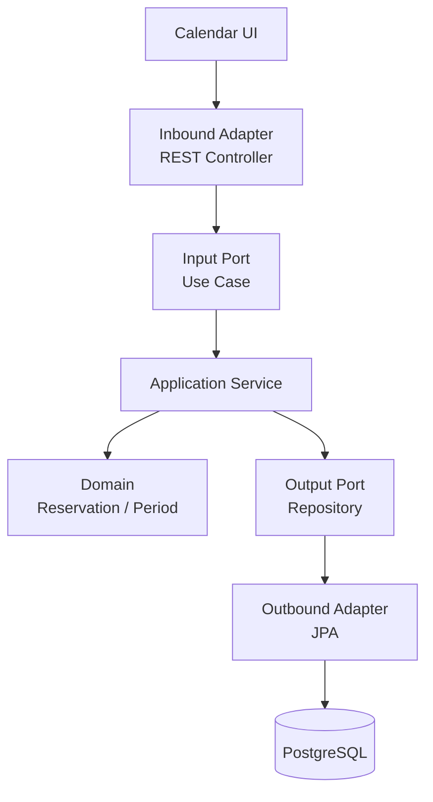
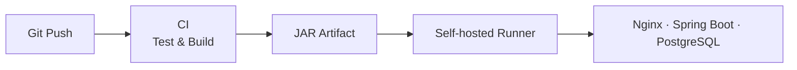

# Reserve Hub

> 중복 예약을 방지하고 외부 기술의 변경에 유연하게 대응하도록 설계한 리소스 예약 플랫폼

Reserve Hub는 회의실·좌석·장비처럼 일정 시간 동안 공유하는 자원을 예약하기 위한 Spring Boot 애플리케이션입니다. 현재 데모에서는 사내 회의실 예약을 사용 사례로 제공하며, 핵심 도메인은 특정 업종에 종속되지 않도록 구성했습니다.

프로젝트에서 가장 중요하게 다룬 문제는 다음 두 가지입니다.

1. 같은 자원과 겹치는 시간대에 여러 예약이 생성되지 않도록 안전하게 보호하기
2. Web, 데이터베이스와 같은 외부 기술이 변경되어도 핵심 예약 규칙을 유지하기

## 주요 기능

- 회의실과 시간대를 선택한 예약 생성
- 예약 ID 기반 단건 조회
- 예약 상태를 유지하는 취소 처리
- 취소된 시간대의 재예약
- 자원·시간대별 예약 가능 여부 조회
- 겹치는 확정 예약에 대한 `409 Conflict` 응답
- 존재하지 않는 예약에 대한 `404 Not Found` 응답
- PostgreSQL을 이용한 영속성 관리
- 브라우저 기반 회의실 예약 캘린더

## 데모 화면

메인 화면에서는 세 개의 회의실과 날짜·시간대를 선택할 수 있습니다.

- 초록색 `空き`: 예약 가능한 시간
- 파란색 `選択中`: 사용자가 선택한 시간
- 회색 `予約済み`: 이미 확정된 예약이 있는 시간
- 예약 생성 후 `CONFIRMED` 상태 표시
- 예약 취소 후 `CANCELLED` 상태 표시 및 시간대 재개방
- `DBから再照会する` 버튼을 통한 PostgreSQL 저장 결과 확인
- `APIレスポンスを確認` 영역을 통한 HTTP 응답 확인

기존 기술 소개 화면은 다음 경로에서 별도로 확인할 수 있습니다.

```text
/architecture.html
```

## 핵심 비즈니스 규칙

### 예약 시간

예약 종료 시각은 시작 시각보다 뒤여야 합니다. 시간 범위는 `ReservationPeriod` 값 객체가 관리합니다.

### 중복 예약 방지

같은 `resourceId`에 대해 다음 조건을 만족하는 `CONFIRMED` 예약은 동시에 존재할 수 없습니다.

```text
existing.startAt < requested.endAt
AND
existing.endAt > requested.startAt
```

애플리케이션 서비스에서 먼저 중복 여부를 검사하고, PostgreSQL 제약조건을 통해 동시에 들어오는 요청도 최종적으로 보호합니다.

### 예약 취소

예약을 물리적으로 삭제하지 않고 상태를 변경합니다.

```text
CONFIRMED -> CANCELLED
```

취소 이력은 보존하지만 중복 검사에서는 `CANCELLED` 예약을 제외하므로 같은 시간대를 다시 예약할 수 있습니다.

## 헥사고날 아키텍처

핵심 도메인이 Spring MVC, JPA, PostgreSQL과 같은 외부 기술에 직접 의존하지 않도록 포트와 어댑터로 분리했습니다.



### 역할 분리

| 계층 | 역할 | 주요 구성요소 |
|---|---|---|
| Domain | 예약 상태와 시간 규칙 | `Reservation`, `ReservationPeriod`, `ReservationStatus` |
| Application | 유스케이스 흐름 조정 | 생성, 조회, 취소, 예약 가능 여부 서비스 |
| Input Port | 외부에서 호출할 기능 정의 | `CreateReservationUseCase` 등 |
| Output Port | 저장소 기능 추상화 | `ReservationRepositoryPort` |
| Inbound Adapter | HTTP 요청·응답 변환 | `ReservationController`, 예외 처리기 |
| Outbound Adapter | DB 저장 및 도메인 변환 | JPA Repository Adapter |
| Configuration | 구현체 조립 | `ReservationConfiguration` |

도메인과 애플리케이션 서비스에는 `@Entity`, `@Service` 같은 프레임워크 애노테이션을 사용하지 않고, Spring 설정 클래스에서 구현체를 조립합니다.

## 요청 처리 흐름

예약 생성 요청은 다음 순서로 처리됩니다.

```text
Browser
 -> ReservationController
 -> CreateReservationUseCase
 -> CreateReservationService
 -> Reservation domain
 -> ReservationRepositoryPort
 -> JPA Adapter
 -> PostgreSQL
```

웹 화면은 백엔드와 같은 서버에서 제공되므로 별도의 CORS 설정 없이 REST API를 호출합니다.

## 기술 스택

| 구분 | 기술 |
|---|---|
| Language | Java 17, JavaScript |
| Framework | Spring Boot 4.1.1 |
| Web | Spring MVC, REST API, HTML5, CSS3 |
| Persistence | Spring Data JPA, Hibernate |
| Database | PostgreSQL 17+ |
| Migration | Flyway |
| Build | Gradle Wrapper, Groovy DSL |
| Test | JUnit 5, Mockito, MockMvc |
| CI/CD | GitHub Actions |
| Server | Oracle Linux 10, systemd |
| Proxy | Nginx |
| Container | Docker |

## REST API

| Method | Endpoint | 설명 | 성공 응답 |
|---|---|---|---|
| `POST` | `/api/reservations` | 예약 생성 | `201 Created` |
| `GET` | `/api/reservations/{id}` | 예약 단건 조회 | `200 OK` |
| `PATCH` | `/api/reservations/{id}/cancel` | 예약 취소 | `200 OK` |
| `GET` | `/api/reservations/availability` | 예약 가능 여부 확인 | `200 OK` |

### 예약 생성 예시

```http
POST /api/reservations
Content-Type: application/json
```

```json
{
  "resourceId": "10000000-0000-0000-0000-000000000001",
  "memberId": "20000000-0000-0000-0000-000000000001",
  "startAt": "2030-10-01T10:00:00",
  "endAt": "2030-10-01T11:00:00"
}
```

성공 응답:

```json
{
  "id": "생성된 UUID",
  "resourceId": "10000000-0000-0000-0000-000000000001",
  "memberId": "20000000-0000-0000-0000-000000000001",
  "startAt": "2030-10-01T10:00:00",
  "endAt": "2030-10-01T11:00:00",
  "status": "CONFIRMED"
}
```

### 예약 가능 여부 예시

```http
GET /api/reservations/availability
    ?resourceId=10000000-0000-0000-0000-000000000001
    &startAt=2030-10-01T10:00:00
    &endAt=2030-10-01T11:00:00
```

```json
{
  "available": true
}
```

### 오류 응답 예시

```json
{
  "code": "DUPLICATE_RESERVATION",
  "message": "동일한 시간대에 이미 확정된 예약이 존재합니다."
}
```

## 테스트 전략

| 테스트 범위 | 검증 대상 |
|---|---|
| Domain Test | 잘못된 시간 범위, 상태 전이 |
| Application Unit Test | 중복 검사, 조회, 취소, 예약 가능 여부 |
| Persistence Integration Test | JPA 매핑, PostgreSQL 저장·조회, 중복 제약 |
| Web Integration Test | HTTP 상태 코드와 JSON 응답 |
| Regression Test | 전체 테스트 재실행으로 기존 기능 영향 확인 |

전체 테스트:

```powershell
.\gradlew.bat clean test
```

Linux 또는 CI 환경:

```bash
./gradlew clean test
```

## 로컬 실행

### 필요 환경

- Java 17 이상
- PostgreSQL
- 또는 PostgreSQL Docker 컨테이너

### 환경변수

비밀번호는 설정 파일이나 Git 저장소에 직접 기록하지 않습니다.

```powershell
$env:DB_URL = "jdbc:postgresql://localhost:5432/testdb"
$env:DB_USERNAME = "testuser"
$env:DB_PASSWORD = "본인의 PostgreSQL 비밀번호"
```

Spring Boot 실행:

```powershell
.\gradlew.bat bootRun
```

접속 주소:

```text
http://localhost:8080/
```

기술 설명 화면:

```text
http://localhost:8080/architecture.html
```

## 주요 프로젝트 구조

```text
src/main/java/com/dongyun/reservehub/reservation
├── domain
│   ├── model
│   └── exception
├── application
│   ├── port
│   │   ├── in
│   │   └── out
│   └── service
├── adapter
│   ├── in/web
│   └── out/persistence
└── config

src/main/resources
├── db/migration
├── static/index.html
├── static/architecture.html
└── application.properties
```

## CI/CD와 서버 구성

`main` 브랜치에 코드가 Push되면 다음 파이프라인이 실행됩니다.



1. GitHub-hosted Runner에서 Java 17과 PostgreSQL 17 서비스 준비
2. `clean test` 실행
3. `bootJar` 생성 및 Artifact 업로드
4. 테스트 성공 시 Oracle Linux Self-hosted Runner에서 Artifact 다운로드
5. 기존 JAR 백업 후 새 JAR 설치
6. systemd 서비스 재시작
7. 시작 실패 시 이전 JAR로 롤백
8. Nginx를 통해 외부 HTTP 요청 검증

배포 서버에서는 다음 구조를 사용합니다.

```text
Client
 -> firewalld :80
 -> Nginx :80
 -> Spring Boot :8080
 -> PostgreSQL Docker
```

배포 전용 사용자에게 전체 관리자 권한을 부여하지 않고, 승인된 배포 스크립트만 실행할 수 있도록 최소 sudo 권한을 적용했습니다.

## 트러블슈팅 경험

### Self-hosted Runner 인증 실패

- 현상: Runner 등록 후 세션 생성 실패
- 분석: `_diag` 로그와 `chronyc tracking`으로 VM 시간이 약 15시간 50분 느린 것을 확인
- 해결: `chronyc makestep`으로 시스템 시간 동기화
- 학습: 표면적인 인증 오류가 아니라 로그와 시스템 시간을 함께 확인해야 함

### systemd 실행 권한 오류

- 현상: 수동 실행은 성공하지만 서비스에서는 `203/EXEC`
- 분석: SELinux AVC 로그에서 home directory의 실행 차단 확인
- 해결: Runner를 `/opt/actions-runner`로 이동하고 보안 컨텍스트 복원
- 학습: `chmod 777`이나 SELinux 비활성화 없이 올바른 실행 위치와 정책으로 해결

### Nginx 502 Bad Gateway

- 현상: Nginx에서 Spring Boot로 Reverse Proxy 연결 실패
- 분석: SELinux가 Nginx의 8080 포트 연결을 차단
- 해결: 필요한 네트워크 연결 정책만 허용
- 학습: 보안 기능을 해제하기 전에 감사 로그를 통해 차단 원인을 확인

## 설계 선택과 트레이드오프

### 정적 HTML을 선택한 이유

발표 기한 내 핵심 예약 규칙과 아키텍처를 완성하기 위해 별도의 프론트엔드 빌드 시스템을 추가하지 않았습니다. 정적 HTML과 JavaScript가 기존 REST API를 직접 호출하도록 구성하여 배포 단위를 하나로 유지했습니다.

### 예약 가능 여부 요청 방식

현재 발표용 화면은 선택한 회의실의 각 시간대에 예약 가능 여부 API를 호출합니다. 작은 데모 규모에서는 단순하고 이해하기 쉽지만, 운영 규모에서는 날짜별 예약 현황을 한 번에 반환하는 배치 조회 API로 개선할 수 있습니다.

### 헥사고날 아키텍처 적용 범위

프로젝트 규모에 비해 클래스 수가 증가하지만, 도메인 규칙과 외부 기술의 경계를 명확하게 보여주고 저장소 구현 교체와 단위 테스트를 쉽게 만들기 위해 선택했습니다.

## 향후 개선 계획

- 날짜·자원별 예약 목록을 한 번에 조회하는 API
- 인증·인가와 사용자별 예약 관리
- 회의실 정보를 DB에서 관리하는 Resource 도메인
- 예약 목적과 참석 인원 입력
- 낙관적·비관적 잠금 방식 비교 테스트
- 운영 환경 프로필과 Secret 관리 강화
- HTTPS와 모니터링 구성

## 프로젝트에서 배운 점

- 도메인 객체가 상태 변경 규칙을 직접 관리해야 하는 이유
- 포트와 어댑터를 통해 비즈니스 로직과 외부 기술을 분리하는 방법
- 애플리케이션 검사만으로 해결하기 어려운 동시성 문제를 DB와 함께 보호하는 방법
- 단위 테스트, 통합 테스트, 회귀 테스트의 역할 차이
- CI에서 검증된 Artifact만 운영 서버에 배포하는 흐름
- Nginx, systemd, SELinux, NTP 문제를 로그 기반으로 진단하는 방법

## 일본어 프로젝트 소개

> Reserve Hubは、会議室などの共有リソースを時間単位で予約するためのシステムです。重複予約を防止するビジネスルールを中心に、ヘキサゴナルアーキテクチャを適用して、ドメインロジックとWeb・データベースなどの外部技術を分離しました。予約登録、照会、キャンセル、空き状況確認を実装し、PostgreSQL、Flyway、JUnit、GitHub Actionsを利用してテストからデプロイまでの流れを構築しました。

---

**Status:** Core feature and deployment pipeline completed  
**Demo:** Meeting room reservation calendar  
**Architecture:** Hexagonal Architecture / Ports and Adapters
